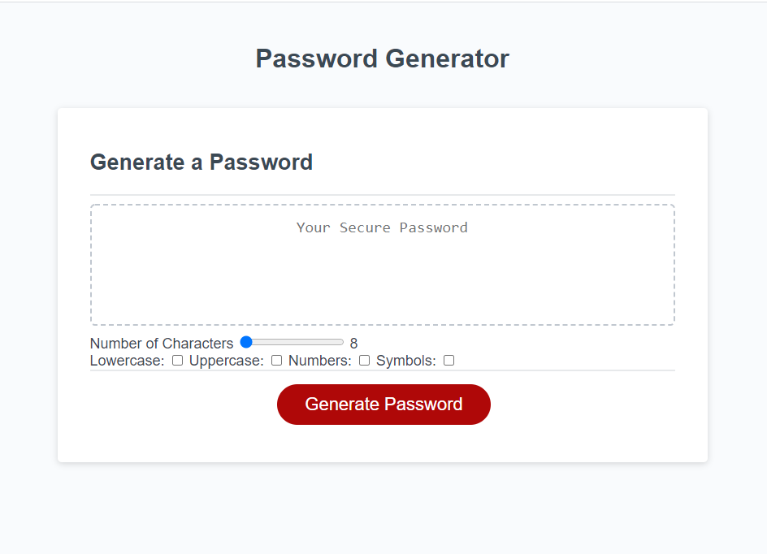

# 03-JavaScript-Password-Generator

# Created by Santiago Hincapie 

# Updated on 10/03/2020

# Link to web site

https://santiagohr2020.github.io/03-JavaScript-Password-Generator/

# Layout

The site uses a slidebar to select the size of the password and limits it to 8 to 128 characters. The criteria is selected via the checkbox instead of popup to make it more efficient. 

# Techonogies used

HTML5, CSS, and JavaScript

# Site Image

